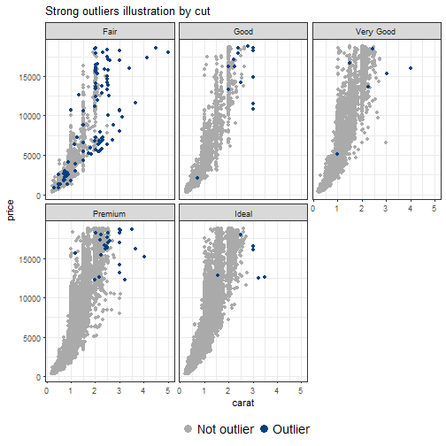
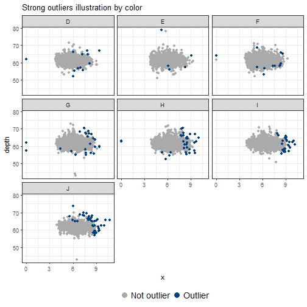
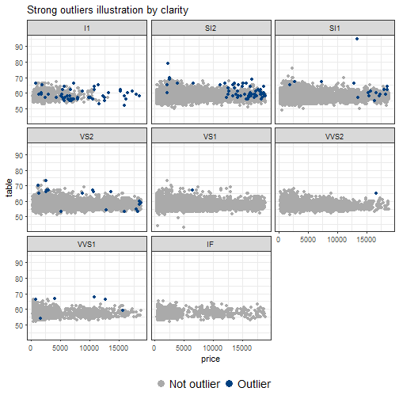

```r
diamonds <- diamonds
library(tidyverse)
library(ruler)

# Observation is not an outlier based on z-score if its absolute value of default z-score is lower then some threshold (popular choice is 3).
isnt_out_z <- function(x, thres = 3, na.rm = TRUE) {
  abs(x - mean(x, na.rm = na.rm)) <= thres * sd(x, na.rm = na.rm)
}

# Observation is not an outlier based on MAD if its absolute value of z-score with median as center and MAD as normalization unit is lower then some threshold (popular choice is 3).
isnt_out_mad <- function(x, thres = 3, na.rm = TRUE) {
  abs(x - median(x, na.rm = na.rm)) <= thres * mad(x, na.rm = na.rm)
}
#Tukey's fences is a technique used in box plots. The non-outlier range is defined with \([Q_1 - k(Q_3 - Q_1),~ Q_3 + k(Q_3 - Q_1)]\), where \(Q_1\) and \(Q_3\) are the lower and upper quartiles respectively, \(k\) - some nonnegative constant (popular choice is 1.5).
# Observation is not an outlier based on Tukey's fences if its value lies in non-outlier range.
isnt_out_tukey <- function(x, k = 1.5, na.rm = TRUE) {
  quar <- quantile(x, probs = c(0.25, 0.75), na.rm = na.rm)
  iqr <- diff(quar)
  
  (quar[1] - k * iqr <= x) & (x <= quar[2] + k * iqr)
}
#All previous approaches were created for univariate numerical data. To detect outliers in multivariate case one can use Mahalanobis distance to reduce to univariate case and then apply known techniques.
# Observation is not an outlier based on Mahalanobis distance if its distance is not an outlier.
maha_dist <- . %>% select_if(is.numeric) %>%
  mahalanobis(center = colMeans(.), cov = cov(.))

isnt_out_maha <- function(tbl, isnt_out_f, ...) {
  tbl %>% maha_dist() %>% isnt_out_f(...)
}


#Combination

isnt_out_funs <- funs(
  z = isnt_out_z,
  mad = isnt_out_mad,
  tukey = isnt_out_tukey
)


diamonds %>% transmute_if(is.numeric, isnt_out_funs)
```

```
## # A tibble: 53,940 x 21
##    carat_z depth_z table_z price_z x_z   y_z   z_z   carat_mad depth_mad
##    <lgl>   <lgl>   <lgl>   <lgl>   <lgl> <lgl> <lgl> <lgl>     <lgl>    
##  1 T       T       T       T       T     T     T     T         T        
##  2 T       T       T       T       T     T     T     T         T        
##  3 T       F       F       T       T     T     T     T         F        
##  4 T       T       T       T       T     T     T     T         T        
##  5 T       T       T       T       T     T     T     T         T        
##  6 T       T       T       T       T     T     T     T         T        
##  7 T       T       T       T       T     T     T     T         T        
##  8 T       T       T       T       T     T     T     T         T        
##  9 T       T       T       T       T     T     T     T         F        
## 10 T       T       T       T       T     T     T     T         T        
## # ... with 53,930 more rows, and 12 more variables: table_mad <lgl>,
## #   price_mad <lgl>, x_mad <lgl>, y_mad <lgl>, z_mad <lgl>, carat_tukey
## #   <lgl>, depth_tukey <lgl>, table_tukey <lgl>, price_tukey <lgl>,
## #   x_tukey <lgl>, y_tukey <lgl>, z_tukey <lgl>
```

```r
diamonds %>%
  transmute(maha = maha_dist(.)) %>%
  transmute_at(vars(maha = maha), isnt_out_funs)
```

```
## # A tibble: 53,940 x 3
##    maha_z maha_mad maha_tukey
##    <lgl>  <lgl>    <lgl>     
##  1 T      T        T         
##  2 T      F        F         
##  3 T      F        F         
##  4 T      T        T         
##  5 T      T        T         
##  6 T      T        T         
##  7 T      T        T         
##  8 T      T        T         
##  9 T      F        F         
## 10 T      F        F         
## # ... with 53,930 more rows
```

```r
data_tbl <- diamonds %>%
  unite(col = "group", cut, color, clarity)

compute_group_non_outliers <- . %>%
  # Compute per group mean values of columns
  group_by(group) %>%
  summarise_if(is.numeric, mean) %>%
  ungroup() %>%
  # Detect outliers among groups
  mutate_if(is.numeric, isnt_out_funs) %>%
  # Remove unnecessary columns
  select_if(Negate(is.numeric))

data_tbl %>% compute_group_non_outliers()
```

```
## # A tibble: 276 x 22
##    group       carat_z depth_z table_z price_z x_z   y_z   z_z   carat_mad
##    <chr>       <lgl>   <lgl>   <lgl>   <lgl>   <lgl> <lgl> <lgl> <lgl>    
##  1 Fair_D_I1   F       T       T       T       T     T     T     F        
##  2 Fair_D_IF   T       T       T       T       T     T     T     T        
##  3 Fair_D_SI1  T       T       T       T       T     T     T     T        
##  4 Fair_D_SI2  T       T       T       T       T     T     T     T        
##  5 Fair_D_VS1  T       T       T       T       T     T     T     T        
##  6 Fair_D_VS2  T       T       T       T       T     T     T     T        
##  7 Fair_D_VVS1 T       T       F       T       T     T     T     T        
##  8 Fair_D_VVS2 T       T       T       T       T     T     T     T        
##  9 Fair_E_I1   T       F       T       T       T     T     T     T        
## 10 Fair_E_SI1  T       T       T       T       T     T     T     T        
## # ... with 266 more rows, and 13 more variables: depth_mad <lgl>,
## #   table_mad <lgl>, price_mad <lgl>, x_mad <lgl>, y_mad <lgl>, z_mad
## #   <lgl>, carat_tukey <lgl>, depth_tukey <lgl>, table_tukey <lgl>,
## #   price_tukey <lgl>, x_tukey <lgl>, y_tukey <lgl>, z_tukey <lgl>
```

```r
row_packs_isnt_out <- row_packs(
  # Non-outliers based on some column
  column = . %>% transmute_if(is.numeric, isnt_out_funs),
  # Non-outliers based on Mahalanobis distance
  maha = . %>% transmute(maha = maha_dist(.)) %>%
    transmute_at(vars(maha = maha), isnt_out_funs)
)

group_packs_isnt_out <- group_packs(
  # Non-outliers based on grouping
  group = compute_group_non_outliers,
  .group_vars = "group"
)

# Don't remove obeyers to compute total number of applied rules
full_report <- data_tbl %>%
  expose(row_packs_isnt_out, group_packs_isnt_out,
         .remove_obeyers = FALSE) %>%
  get_report()

used_rules <- full_report %>%
  distinct(pack, rule)

breaker_report <- full_report %>%
  filter(!(value %in% TRUE))

group_breakers <- breaker_report %>%
  # Filter group packs
  filter(pack == "group") %>%
  # Expand rows by matching group with its rows
  select(-id) %>%
  left_join(
    y = data_tbl %>% transmute(var = group, id = 1:n()),
    by = "var"
  ) %>%
  select(pack, rule, var, id, value)

outliers <- bind_rows(
  breaker_report %>% filter(pack != "group"),
  group_breakers
) %>%
  select(pack, rule, id)

# Not all group based definitions resulted with outliers
outliers %>%
  count(pack, rule) %>%
  filter(pack == "group") %>%
  print(n = Inf)
```

```
## # A tibble: 13 x 3
##    pack  rule            n
##    <chr> <chr>       <int>
##  1 group carat_mad      37
##  2 group carat_tukey    37
##  3 group carat_z        29
##  4 group depth_mad    1093
##  5 group depth_tukey  1016
##  6 group depth_z       156
##  7 group price_mad     209
##  8 group price_tukey  1146
##  9 group price_z        44
## 10 group table_mad     920
## 11 group table_tukey     8
## 12 group table_z         7
## 13 group z_z            23
```

```r
outliers %>%
  count(pack, rule, sort = TRUE)
```

```
## # A tibble: 37 x 3
##    pack   rule            n
##    <chr>  <chr>       <int>
##  1 maha   maha_mad     6329
##  2 maha   maha_tukey   5511
##  3 column price_mad    5386
##  4 column price_tukey  3540
##  5 column table_mad    2560
##  6 column depth_tukey  2545
##  7 column depth_mad    2261
##  8 column carat_tukey  1889
##  9 column price_z      1206
## 10 group  price_tukey  1146
## # ... with 27 more rows
```

```r
outlier_score <- outliers %>%
  group_by(id) %>%
  # nrow(used_rules) equals total number of applied methods
  summarise(score = n() / nrow(used_rules))

# Top 10 outliers
outlier_score %>% arrange(desc(score)) %>% slice(1:10)
```

```
## # A tibble: 10 x 2
##       id score
##    <int> <dbl>
##  1 26432 0.578
##  2 27416 0.578
##  3 27631 0.578
##  4 27131 0.467
##  5 23645 0.422
##  6 26445 0.422
##  7 26745 0.400
##  8 27430 0.400
##  9 15952 0.378
## 10 17197 0.378
```

```r
diam_tbl <- diamonds %>%
  mutate(id = 1:n()) %>%
  left_join(y = outlier_score, by = "id") %>%
  mutate(
    score = coalesce(score, 0),
    is_out = if_else(score > 0.2, "Outlier", "Not outlier")
  )

# Total number of outliers
sum(diam_tbl$score > 0.2)
```

```
## [1] 161
```

```r
theme_set(theme_bw())

plot_outliers <- function(tbl, x, y, facet_var) {
  tbl %>%
    arrange(is_out) %>%
    ggplot(aes_string(x, y, colour = "is_out")) +
    geom_point() +
    facet_wrap(facets = facet_var) +
    scale_colour_manual(values = c("#AAAAAA", "#004080")) +
    guides(colour = guide_legend(title = NULL,
                                 override.aes = list(size = 4))) +
    labs(title = paste0("Strong outliers illustration by ", facet_var)) +
    theme(legend.position = "bottom",
          legend.text = element_text(size = 14))
}

diam_tbl %>% plot_outliers("carat", "price", facet_var = "cut")
```



```r
diam_tbl %>% plot_outliers("x", "depth", facet_var = "color")
```



```r
diam_tbl %>% plot_outliers("price", "table", facet_var = "clarity")
```



```r
#Based on those plots we see the complicated nature of "strong outliers". They are not necessary located "on the edge" of two-dimensional scatter plots, but most extreme cases are tagged as outliers.
#Also one interesting observation: most outliers are concentrated in the combination of "Fair" cut, "J" colour and "I1" clarity which are worst options among their features. The reason of this effect is group-based definitions of non-outliers which tagged certain groups more than others:
  

breaker_report %>%
  filter(pack == "group") %>%
  count(var, sort = TRUE) %>%
  print(n = 10)
```

```
## # A tibble: 47 x 2
##    var             n
##    <chr>       <int>
##  1 Fair_D_I1       7
##  2 Fair_J_I1       7
##  3 Fair_H_VVS1     6
##  4 Ideal_J_I1      6
##  5 Fair_J_VVS1     5
##  6 Fair_G_VVS1     4
##  7 Fair_D_VVS1     3
##  8 Fair_E_I1       3
##  9 Fair_F_I1       3
## 10 Fair_H_I1       3
## # ... with 37 more rows
```

```r
#Conclusions
#???	Using only basic outlier detection methods one can achieve insightful results by combining them. Observations which are tagged as outlier by more than some threshold number of methods might be named as "strong outliers". Those should be considered as outliers based on the whole data rather then on separate features.
#???	With ruler combining results of several outlier detection methods is straightforward due to the format of tidy data validation report.
#???	Suggested "strong outlier" observations in diamonds dataset are not only those with extreme numerical values but also ones based on quality of diamonds. This is achieved without prior knowledge of "diamond quality" notion.
```

